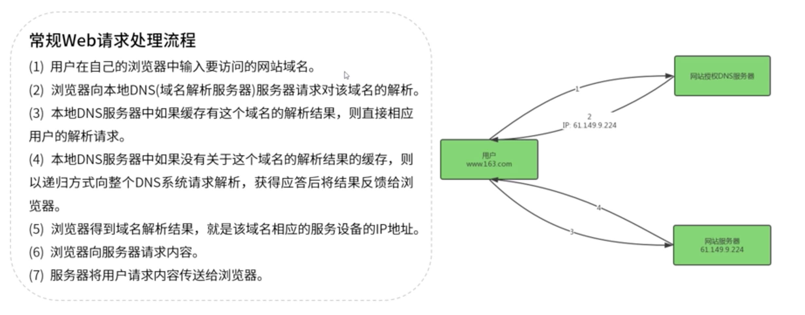
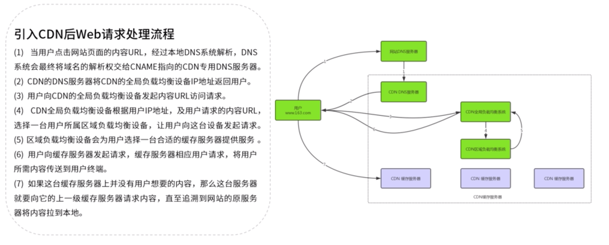

# CDN的原理和实现方式
<!-- ttoc -->
## 原理

将原本单中心单服务器的C/S模式网站分布到数个离用户更近的缓存服务器上，当用户访问网站时让用户从缓存服务器上取数据，从而缓解中心服务器的负担。

## 实现方式

### 没有CDN的网络访问

* 输入URL
* 浏览器向DNS服务器查找网站服务器IP地址
* 通过IP地址从网站服务器处获取网站

### 有CDN的网络访问

* 输入URL
* 浏览器向DNS服务器查找IP地址
* DNS服务器把域名解析权交给某个CDN专用DNS服务器
* 专用DNS服务器返回给用户的是负载均衡器的IP地址
* 浏览器向负载均衡器处请求网站
* 负载均衡器再指示浏览器跳转到某个CDN服务器(返回跳转指令和IP或者域名)
* 浏览器跳转到CDN服务器处获取网站

