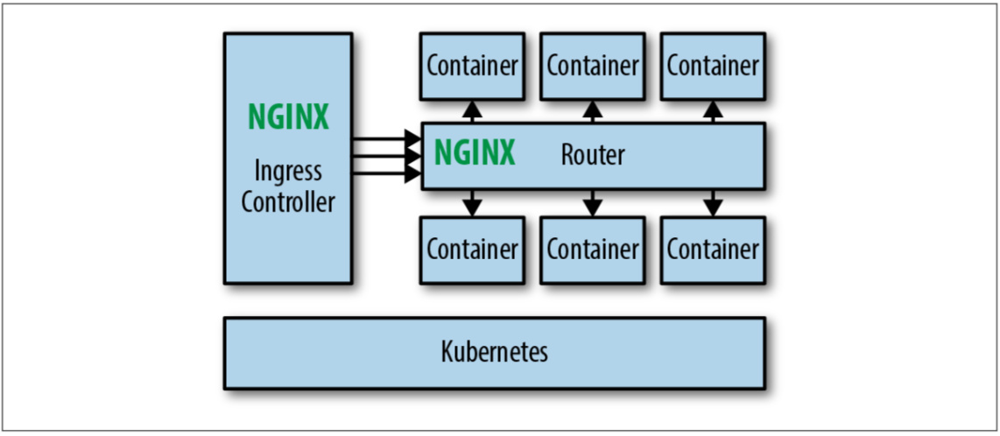
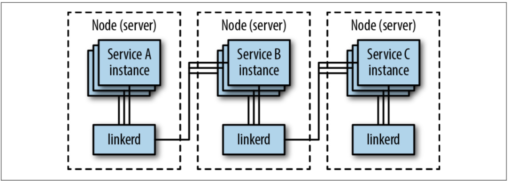
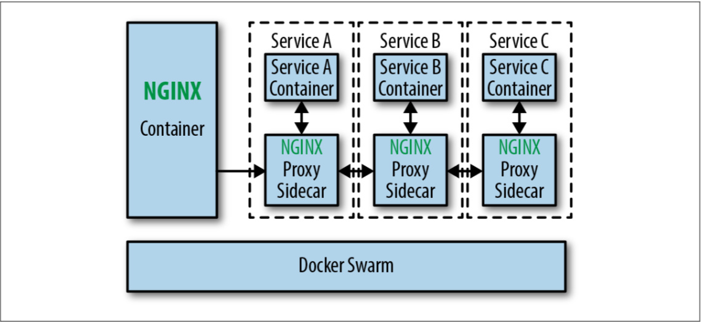

[参考教程](https://www.servicemesher.com/istio-handbook/intro/service-mesh-the-microservices-in-post-kubernetes-era.html)

Service Mesh 是一个**基础设施层，用于处理服务间通信**。云原生(Cloud Native)应用有着复杂的服务拓扑，Service Mesh 保证请求可以在这些拓扑中可靠地穿梭。在实际应用当中，Service Mesh 通常是由**一系列轻量级的网络代理组成的**，它们与应用程序部署在一起，但应用程序不需要知道它们的存在。

上图展示了Service Mesh框架下应用的基本架构，其中蓝色的部分是Service Mesh框架所控制的部分，绿色是开发人员需要关注的部分，灰色是基本的网络架构。Service Mesh归根结底就是一个复杂但易于控制的TCP/IP请求代理(Proxy)，将请求发送到正确的地方就是它的全部任务。

## 知识图谱

```mermaid
graph TD
CloudNative[Cloud Native]-->ServiceMesh[Service Mesh]
ServiceMesh-->Pattern[实现模式]
Pattern-->Ingress[Ingress或边缘代理]
Pattern-->RouterMesh[路由器网格]
Pattern-->ClientDevelopKit[客户端库]
Pattern-->ProxyperNode[Proxy per Node]
Pattern-->Fabric[Sidecar代理/Fabric模型]
Pattern-->Sidecar[Sidecar代理/控制平面]
Ingress-->|演进|RouterMesh-->|演进|ClientDevelopKit-->|演进|ProxyperNode-->|演进|Fabric-->|演进|Sidecar
ServiceMesh-->Frames[开发框架]
Frames-->Istio
Frames-->Linkerd
Linkerd-->Conduit
Istio-->Envoy
Envoy-->xDS
Linkerd-->Sidecar
Istio-->Sidecar
k8s[Kubernetes]-->|基础|Istio
```

## Service Mesh基本思想

Linkerd 为例讲解 Service Mesh 如何工作，Istio的工作方式和这个大差不离。

* 路由和转发过程：
  1. 获取：Linkerd 收到应用发来的服务请求，根据其中的参数判断转发的目的地址（是到生产环境、测试环境还是staging环境中的服务？是路由到本地环境还是公有云环境？所有的这些路由信息可以动态配置，可以是全局配置也可以为某些服务单独配置）
  2. 当 Linkerd 确认了目的地址后，将流量发送到相应服务发现端点（在kubernetes中是一个pod），然后pod会将服务转发给后端的实例
  3. Linkerd 记录响应的类型和延迟等相关数据
* 路由和转发过程中的实例选择方式：
  1. Linkerd 根据记录到的延迟时间数据，选择出所有应用程序的实例中响应最快的实例
  2. 如果该实例挂了、不响应了或者进程不工作了，Linkerd 将把请求发送到其他实例上重试
  3. 如果该实例持续返回 error，Linkerd 会将该实例从负载均衡池中移除，稍后再周期性得重试
  4. 如果请求的截止时间已过，Linkerd 主动失败该请求，而不是再次尝试添加负载
* Linkerd 以 metric 和分布式追踪的形式捕获上述行为的各个方面，这些追踪信息将发送到集中 metric 系统

### Istio和Linkerd在原理上的区别

Istio是使用Sidecar模式，**将Envoy植入到Pod中**，而Linkerd则是**在每台node上都以DaemonSet的方式运行**。

## Service Mesh的几种实现模式

下图展示了Service Mesh架构最终要实现的效果，接下来的几节将介绍微服务架构从Spring Cloud这种客户端库阶段一步步演进到Service Mesh最终形态的过程。

### Ingress或边缘代理

如果你使用的是Kubernetes做容器编排调度，那么在进化到Service Mesh架构之前，通常会使用Ingress Controller（如Traefik或Nginx Ingress Controller），做集群内外流量的**反向代理**。

这种模式是将一个反向代理服务器顶在前面，接收来自外网的请求，然后将其转发到内网的指定服务中。此种服务只能管理外来流量，进行一些负载均衡之类的操作，而无法管理服务间流量。这意味着反向代理服务器后面的应用间都必须互相独立，不能互相调用。

### 路由器网格

在Ingress Controller的基础上在加一个Router层，即路由器层，让集群内所有服务间的流量都通过该路由器，这就就构成了路由器网格架构。

Docker-compose中自带的DNS功能就是一种典型的路由器层，在一个微服务中调用其他微服务的方法就是向一个指定的域名发送请求，由路由器层负责将这个请求转发到正确的位置。

这个架构无需对原有的单体应用和新的微服务应用做什么改造，可以很轻易的迁移进来，但是当服务多了管理起来就很麻烦。

### 客户端库模式

客户端库意味着客户端在开发的时候就要将微服务相关的通信组件整合到了应用中，属于侵入式开发，这种架构的缺点很明显：服务逻辑与微服务框架耦合度过高，应用的开发质量过于依赖框架的完善程度，并且对于服务来说完全不透明，非常不利于多语言开发。

### Proxy per Node

Proxy per Node顾名思义就是在每个节点上都部署一个代理，每个Node中都有多个Pod(Service)，每个代理都分别知道来自各自Node中的请求的转发规则。第一代Linkerd就是这种架构的典型代表，Proxy在第一代Linkerd中叫做DaemonSet。

这种架构有个好处是每个节点只需要部署一个代理即可，比起在每个应用中都侵入式地安装一个通信组件的方式更节省资源，更适合基于物理机/虚拟机的大型单体应用。这种架构也容易出现一个Node的Proxy出错导致整个Node的Service都无法访问的情况，并且这种架构虽然可以跨语言了，也还没有达到对应用的完全透明。

### Sidecar代理/Fabric模型

这个一般不会成为典型部署类型，当企业的服务网格架构演进到这一步时通常只会持续很短时间，然后就会增加控制平面。跟前几个阶段最大的不同就是，**应用程序和代理被放在了同一个部署单元里**，应用的结构不再是一个Proxy负责一个Node，而是一个Proxy负责一个Pod(Service)，因此可以对应用程序的流量做更细粒度的控制。此架构下的Service Mesh不再有Node的概念，微服务以Pod(Service)为单位。

这已经是最接近Service Mesh架构的一种形态了，唯一缺的就是控制平面了。所有的Sidecar都支持热加载，配置的变更可以很容易的在流量控制中反应出来，只需要一个对Sidecar配置进行统一管理的控制平面即可达到Service Mesh的最终形态。

### Sidecar代理/控制平面

在一众Sidecar代理的基础上加上一个控制平面，即可达到Service Mesh的最终形态，这也是目前大多数生产级Service Mesh的架构。

这种架构将代理作为整个服务网格中的一部分，使用Kubernetes部署的话，可以通过以sidecar的形式注入，减轻了部署的负担，可以对每个服务的做细粒度权限与流量控制。但有一点不好就是为每个服务都注入一个代理会占用很多资源，因此要想方设法降低每个代理的资源消耗。
