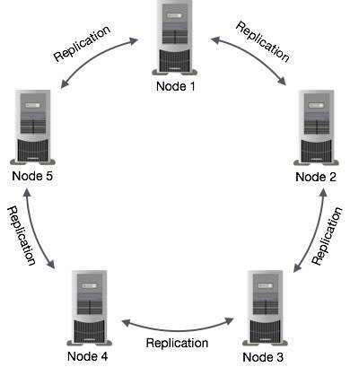
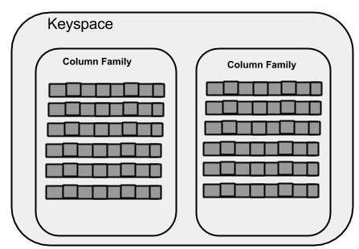
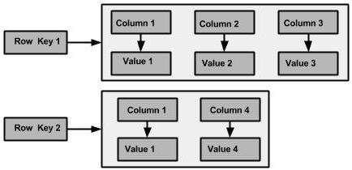

---
---
# Cassandra简介

Cassandra的设计目的是处理跨多个节点的大数据工作负载，而没有任何单点故障。Cassandra没有像BigTable或Hbase那样选择中心控制节点，而选择了**无中心的P2P架构**，网络中的**所有节点都是对等的**，它们构成了一个**环**，节点之间通过P2P协议每秒钟交换一次数据，这样**每个节点都拥有其它所有节点的信息**，包括位置、状态等。

* 集群中的所有节点都扮演相同的角色。 每个节点是独立的，并且同时互连到其他节点。
* 集群中的**每个节点都可以接受读取和写入请求**，无论数据实际位于集群中的何处。
* 当节点关闭时，可以从网络中的其他节点提供读/写请求。

## 总体架构

### 关键算法

* Gossip：点对点的通讯协议，用来相互交换节点的位置和状态信息。当一个节点启动时就立即本地存储Gossip信息，但当节点信息发生变化时需要清洗历史信息，比如IP改变了。通过Gossip协议，每个节点定期每秒交换它自己和它已经交换过信息的节点的数据，每个被交换的信息都有一个版本号，这样当有新数据时可以覆盖老数据，为了保证数据交换的准确性，所有的节点必须使用同一份集群列表，这样的节点又被称作seed。
* Partitioner：负责在集群中分配数据，由它来决定由哪些节点放置第一份的copy，一般情况会使用Hash来做主键，将每行数据分布到不同的节点上，以确保集群的可扩展性。
* Replica placement strategy：复制策略，确定哪个节点放置复制数据，以及复制的份数。
* Snitch：定义一个网络拓扑图，用来确定如何放置复制数据，高效地路由请求。

### 关键组件

* 节点：存储数据的地方
* 数据中心：相关节点的集合
* 集群：包含一个或多个数据中心的组件
* 提交日志：提交日志是Cassandra中的崩溃恢复机制。每个写操作都写入提交日志。
* Memtable：驻留于内存中的缓存。写操作提交日志后，数据将被写入memtable。有时，对于单列族，将有多个mem表。
* SSTable：它是一个磁盘文件格式，当其内容达到阈值时，数据从mem表中刷新。
* 布隆(Bloom)过滤器：这些只是快速，非确定性的算法，用于测试元素是否是集合的成员。它是一种特殊的缓存。每次查询后访问Bloom过滤器。
* cassandra.yaml：主配置文件，设置集群的初始化配置、表的缓存参数、调优参数和资源使用、超时设定、客户端连接、备份和安全

### 集群数据复制

在Cassandra中，集群中的一个或多个节点充当给定数据片段的副本。如果检测到一些节点以过期值响应，Cassandra将向客户端返回最近的值。返回最新的值后，Cassandra在后台执行读修复以更新失效值。

Cassandra在后台使用Gossip协议，允许节点相互通信并检测集群中的任何故障节点。



### 数据操作

用户可以使用Cassandra查询语言（CQL）通过其节点访问Cassandra。CQL将数据库（Keyspace）视为表的容器。 程序员使用cqlsh或单独的应用程序语言执行查询。

客户端针对其读写操作访问任何节点。该节点（协调器）在客户端和保存数据的节点之间播放代理。

#### 写操作

写->日志->memtable->SSTable

1. 节点的每个写入活动都由写在节点中的提交日志捕获
2. 稍后数据将被捕获并存储在内存memtable中
3. 每当memtable满时，数据将写入SStable数据文件
4. 所有SStable写入都会在整个集群中自动分区和复制。Cassandra会定期整合SSTables，丢弃不必要的数据

Cassandra对写操作的处理和传统关系数据库完全不一样，并不立即对原有数据进行更新，而是会增加一条新的记录，后续在进行Compaction时将数据再进行合并。Update操作也是如此，Delete操作也同样如此，要删除的数据会先标记为Tombstone，后续进行Compaction时再真正永久删除。

#### 读操作

1. 首先检查Bloom filter，每一个SSTable都有一个Bloom filter用来检查partition key是否在这个SSTable。这一步在访问磁盘IO前完成
2. 如果存在，再检查内存中的键缓存partition key cache：
   * 如果在cache中能找到索引，到compression offset map中找拥有这个数据的数据块，从磁盘上取得压缩数据并返回结果集。
   * 如果在cache中找不到索引，搜索partition summary确定索引在磁盘上的大概位置，然后获取索引入口，在SSTable上执行一次单独的寻道和一个顺序的列读取操作，放入partition key cache，然后再执行上一步

读取数据时会合并Memtable中缓存的数据、多个SSTable中的数据，才返回最终的结果。比如更新用户Email后，用户名、密码等还在老的SSTable中，新的EMail记录到新的SSTable中，返回结果时需要读取新老数据并进行合并（用时间戳）。

#### 数据整理

Cassandra整理面临两种数据：

* 更新和插入操作数据：更新和插入操作不会立即更新，这样会导致随机读写磁盘，效率不高，Cassandra会把数据顺序写入到一个新的SSTable，并打上一个时间戳以标明数据的新旧。
* 删除操作数据：删除操作不会立马做删除操作，而是用Tombstone来标记要删除的数据。

Compaction时，将多个SSTable文件中的数据整合到新的SSTable文件中，当旧SSTable上的读请求一完成，会被立即删除，空余出来的空间可以重新利用。虽然Compcation没有随机的IO访问，但还是一个重量级的操作，一般在后台运行，并通过限制它的吞吐量来控制。

## 数据模型

### 键空间 （Keyspace）



键空间是Cassandra中数据的最外层容器，相当于关系型数据库中的Database。Cassandra中的一个键空间有三个基本属性：

* 复制因子：集群中将接收相同数据副本的计算机数。
* 副本放置策略：把副本放在集群（环）中的策略。
  * 简单策略（机架感知策略）SimpleStrategy：为集群指定简单的复制因子
  * 网络拓扑策略（数据中心共享策略）NetworkTopologyStrategy：单独为每个数据中心设置复制因子
  * 旧网络拓扑策略（机架感知策略）：单独为每个数据中心设置复制因子
* 列族：键空间是一个或多个列族的列表的容器。列族又是一个行集合的容器。每行包含有序列。

### 列族（Column Family）

#### 从 CQL 3 开始，列族被称为"table"

此处有脑筋急转弯：Cassandra和关系型数据库的table表面上是一样的，但是一个是BigTable中的键族一个是关系数据表，是完全不一样的

关系模型 | Cassandra列族
-|-
关系模型中的列是固定的，每一行的所有列必须至少填充一个空值|在Cassandra中，虽然定义了列族，但列不是固定的，可以随时向任何列族自由添加任何列。
关系表只定义列，用户用值填充表|在Cassandra中，表定义列族，用户用列填充列族

Cassandra列族具有以下属性：

* keys_cached：每个SSTable保持缓存的位置数
* rows_cached：整个内容将在内存中缓存的行数
* preload_row_cache：是否要预先填充行缓存

与不是固定列族的模式的关系表不同，Cassandra不强制单个行拥有所有列。
下图显示了Cassandra列族的示例。



### 列

Cassandra的基本数据结构，具有三个值，即键或列名称name，值value和时间戳timestamp。和关系数据库不同的是，Cassandra的一行中可以有任意多个column，而且每行的column可以是不同的。这也是为什么说Cassandra具备非常灵活schema的原因。


column name存放真正的值，而value是空。因为Cassandra是按照column name排序，而且是按列存储的，所以往往利用column name存放真正的值，而value部分则是空。例如：“jacky”:“null”，“fenng”:”null”。

### 超级列

Super column是一种特殊的column，里面可以存放任意多个普通的column。而且一个CF中同样可以有任意多个Super column

一个列族只能定义使用Column或者Super column，不能混用。

Super column可以看作是一个索引，有点象关系型数据库中的外键，利用super column可以实现快速定位，因为它可以返回一堆column，而且是排好序的。

### 附：排序

不同于数据库可以通过Order by定义排序规则，Cassandra取出的数据顺序是**总是一定的**，数据**保存时已经按照定义的规则存放**，所以取出来的顺序已经确定了，这是一个巨大的性能优势。

Cassandra按照column name而不是column value来进行排序。

## CQL的使用方法

### 键空间

#### 创建

```cql
CREATE KEYSPACE <键空间名> WITH replication = {'class': '<复制选项>', 'replication_factor' : '<复制因子>'};
```

这里replication里面的两个选项就是上面键空间介绍中说的复制选项和复制因子。'replication_factor'选项只有在'class'是'SimpleStrategy'才可以用（因为其他两个都要单独为每个集群指定复制因子）

#### 修改和删除

```cql
ALTER KEYSPACE <键空间名> WITH replication = {'class': '<复制选项>', 'replication_factor' : '<复制因子>'};
DROP KEYSPACE <键空间名>;
```

ez，不多讲

#### 其他常用键空间操作

```cql
DESCRIBE keyspaces;//列出所有键空间
USE <键空间名>;//同SQL中的use数据库一样
```

### 表（键族）

#### 创建表

```cql
CREATE (TABLE | COLUMNFAMILY) <表名>(
    <列名> <数据类型> [PRIMARY KEY],
    <列名> <数据类型>
)WITH <option> AND <option>
```

#### 表和索引的修改/删除/创建

都和SQL差不多，不常用，先略

#### 截断表

清除表中所有数据

```cql
TRUNCATE <表名>
```

#### 批处理操作

一次执行多个语句

```sql
BEGIN BATCH
<语句>;
<语句>;
<语句>;
APPLY BATCH;
```